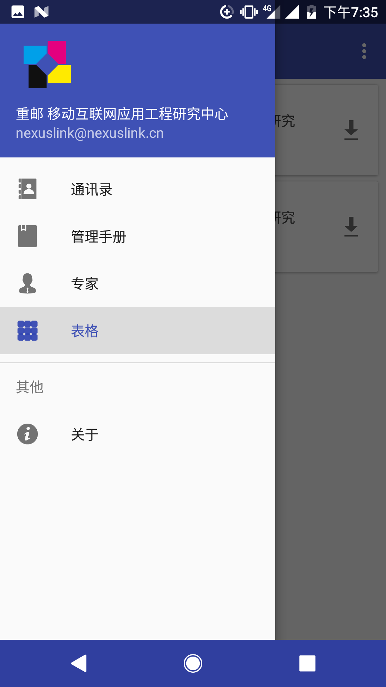
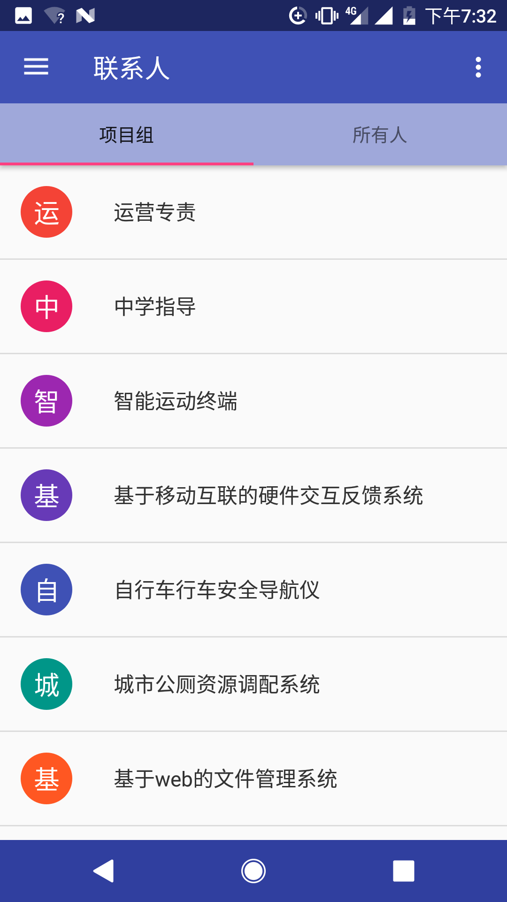
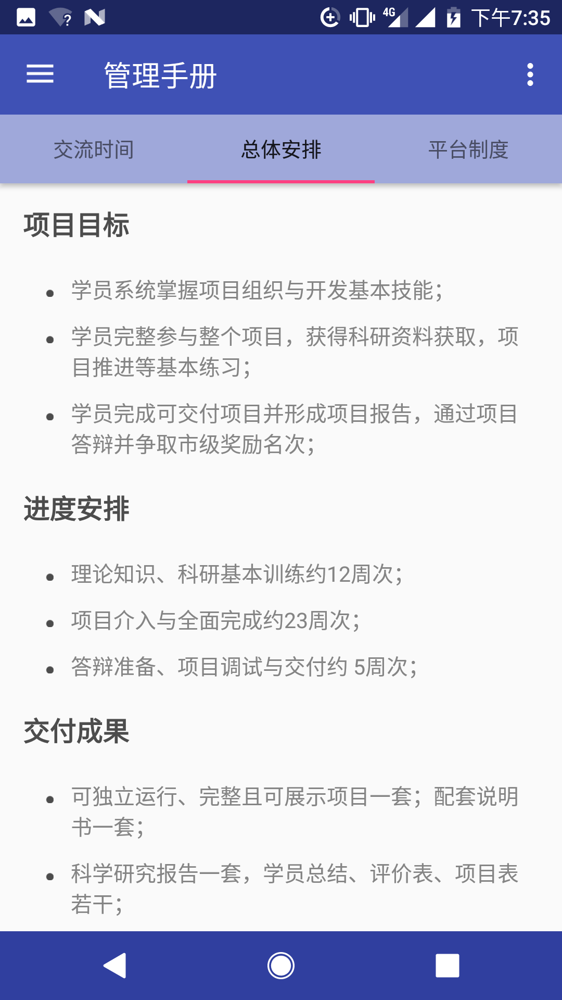
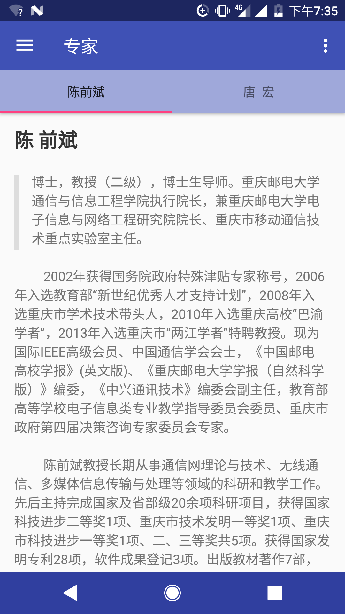
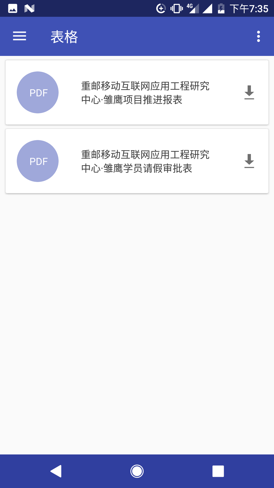
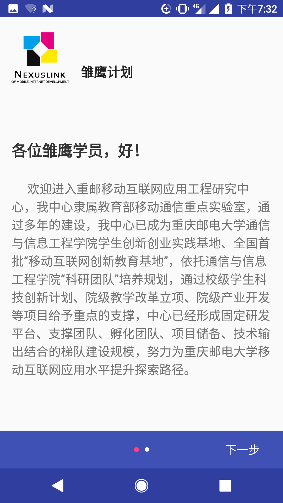

# 《雏鹰计划手册》Demo版介绍
[toc]
##概述
### 项目结构
> 通过归纳总结，主要将App分为了4个板块来做
>  - 通讯录
>  - 管理手册
>  - 专家介绍
>  - 表格下载
>  

Demo版截图

###设计
> 控件和色彩上都采用Google原生的Material Design风格

##详细介绍
### 通讯录
> 

> 借鉴原生系统通讯录，将联系人根据项目组分了类，当然也可以滑动查找所有人，通过A-Z排序，方便查找
> 

> 个人信息界面，除了展示个人信息外，添加一键拨号，联系更方便

###管理手册&&专家介绍
> 
> 
> 这两个部分都是纯文本，采用Markdown，在简洁的同时也方便字体管理样式

###表格 
> 
文档中出现了两处表格，计划从服务器端下载表格，这里就只做了UI部分

##More
###启动画面
> 
Logo有由虚到实的动画

###导向
> 
主要是研究中心对雏鹰学院想说的话，只出现在第一次使用此App

